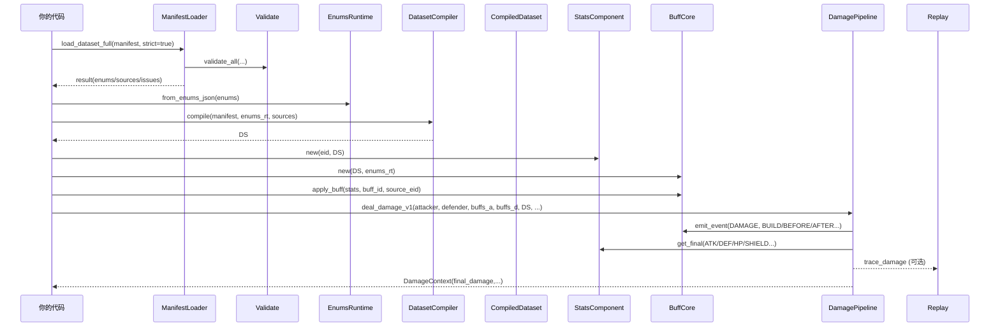

# 02 — Quickstart：跑通一次“上 Buff → 结算伤害”

本章的目标非常具体：让你在 **不理解所有细节** 的情况下先跑通一刀，并看到：
- 数据集如何加载与编译
- Stats/Buff/Pipeline 如何被创建
- runtime dict 为什么必须存在
- 如何读取 HP 的 final，以及 UI 面板用的 base/bonus/final

---

## 1. 前置条件

1) 把插件目录放到项目中：

```
res://addons/omnibuff/
```

2) 在编辑器启用插件：
- `Project → Project Settings → Plugins → OmniBuff → Enable`

启用后项目里会有 Autoload：`/root/OmniBuff`。

---

## 2. 最小可运行示例（建议直接复制）

> 你可以把这段代码放到任意 Node 脚本里（例如一个临时 scene 的 _ready 里），运行一次即可。

```gdscript
extends Node

func _ready() -> void:
	run_one_hit()


func run_one_hit() -> void:
	# 1) 加载数据集（strict=true：校验失败直接阻断）
	var result := OmniBuff.ManifestLoader.load_dataset_full("res://data/rpg_tests/manifest.json", true)
	if not result.issues.is_empty():
		for issue in result.issues:
			push_error("%s %s %s: %s" % [issue.file, issue.loc, issue.id, issue.message])
		return

	# 2) enums_rt：把字符串枚举变成 int code / tags bitmask
	var enums_rt := OmniBuff.EnumsRuntime.from_enums_json(result.enums)

	# 3) ds：编译产物（运行时只读它，不读 raw json）
	var ds := OmniBuff.DatasetCompiler.compile(result.manifest, enums_rt, result.sources)

	# 4) 运行时对象
	var pipe := OmniBuff.DamagePipeline.new()
	var replay := OmniBuff.Replay.new()

	# 5) 两个实体（纯数据，不依赖场景树）
	var attacker := OmniBuff.StatsComponent.new(101, ds)
	var defender := OmniBuff.StatsComponent.new(202, ds)
	var buffs_a := OmniBuff.BuffCore.new(ds, enums_rt)
	var buffs_d := OmniBuff.BuffCore.new(ds, enums_rt)

	# 6) runtime dict（事件动作跨实体定位目标时需要）
	var runtime := {
		"stats_by_entity": {101: attacker, 202: defender},
		"buff_by_entity":  {101: buffs_a, 202: buffs_d},
	}

	# 7) 施加一个 Buff（可选）
	# 注意：buff_id 必须存在于 buff_defs.json
	buffs_a.apply_buff(attacker, "buff_food_atk_20_5t", attacker.entity_id)

	# 8) 结算一次伤害
	var tags_mask := int(enums_rt.tag_mask(["BUFF"]))
	var ctx := pipe.deal_damage_v1(attacker, defender, buffs_a, buffs_d, ds, 10.0, replay, 1, tags_mask, runtime)
	print("[hit] final_damage=", ctx.final_damage)

	# 9) 读取 defender 的 HP（final）与 breakdown（base/bonus/final）
	var hp_id := int(ds.stat_id("HP"))
	print("[defender] HP(final)=", defender.get_final(hp_id))
	var bd := defender.get_breakdown(hp_id)
	print("[defender] HP base=", bd["base"], " bonus=", bd["bonus"], " final=", bd["final"])
```

---

## 3. 发生了什么？（时序图）



---

## 4. 常见问题（新手最容易卡住的点）

### 4.1 为什么必须传 runtime？

很多 action（例如 `APPLY_BUFF` / `DISPEL` / `ADD_STACKS`）需要定位目标实体：
- 它们不是“遍历全体单位”，而是根据 scope 解析出 `target_eid`，再去 runtime 里取对象引用。

因此 runtime 是契约的一部分：

```gdscript
runtime = {"stats_by_entity": {eid: StatsComponent}, "buff_by_entity": {eid: BuffCore}}
```

### 4.2 我怎么知道 buff_id 对不对？

去对应数据集的 `buff_defs.json` 查 `id` 字段：
- `res://data/rpg_tests/buff_defs.json`
- `res://data/base_demo/buff_defs.json`

建议调试时直接打开 UI demo：`res://addons/omnibuff/demo/buff_ui_demo.tscn`，它会输出更详细日志并有 ErrorList。

---

## 本章小结

你已经跑通了一刀，并知道：
- 数据集如何加载与编译
- runtime dict 的作用
- 如何读取 final 与 get_breakdown（UI 面板用）

下一章我们解释数据链路的每个文件与边界：`03_data_pipeline.md`

