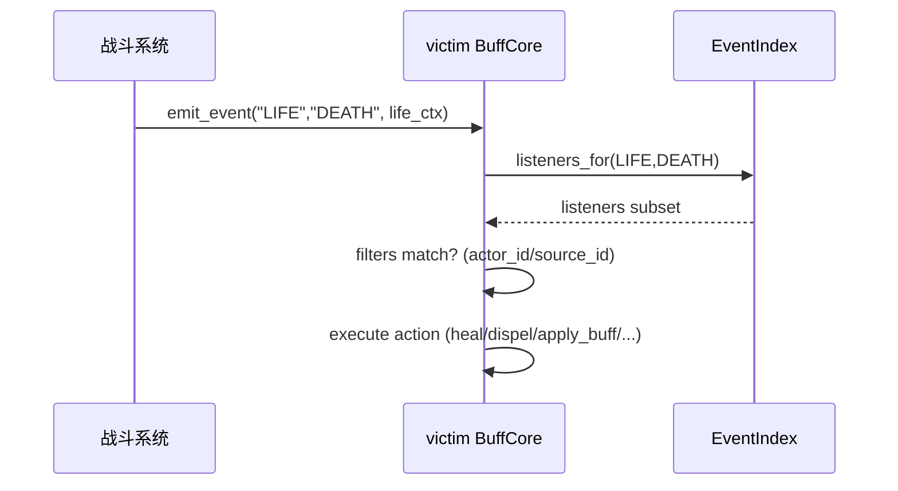

# 05 — Buff 与事件系统：BuffCore、stack、EventIndex、LIFE/STACKS

本章目标：
- 理解 BuffCore 的数据结构（BuffInst、DotInstance）
- 理解 EventIndex 如何做到“只遍历监听子集”
- 学会写 triggers（filters + actions + scope）
- 理解 Phase 1 的 LIFE 与 stacks actions

---

## 1. BuffCore 的核心职责

每个实体（actor/unit）通常有一个 BuffCore：

- 管理该实体身上的 buff 实例（BuffInst）
- 管理该实体作为 DOT 目标时的 dot 池（DotInstance）
- 维护 EventIndex（监听表）并在 emit_event 时执行 filters/actions
- 在 buff 激活/失活时注入/撤销 Stats modifiers（触发 Stats dirty）

代码位置：
- `res://addons/omnibuff/runtime/core/buff_core.gd`
- `res://addons/omnibuff/runtime/core/event_index.gd`

---

## 2. 事件分发：为什么不会遍历“全体 Buff”

关键点：EventIndex 把 “监听者” 按 (event_type,event_phase) 预索引。

```mermaid
flowchart TD
  A[BuffCore.emit_event(event_type, phase, ctx)] --> B[EventIndex.get_listeners_for(key)]
  B --> C{遍历 listeners 子集}
  C --> D[filters 匹配?]
  D -->|yes| E[执行 action]
  D -->|no| C
```

这意味着：
- emit_event 的复杂度是 **O(该事件监听者数量)**  
而不是 O(实体身上 buff 总数) 或 O(全场 buff 总数)

---

## 3. triggers 的结构（你写配置时最常用）

buff_defs 的 trigger 结构：

```jsonc
{
  "event_type": "DAMAGE",
  "event_phase": "AFTER_TAKE",
  "scope": "SELF",
  "filters": { "require_hit": true },
  "action": { "kind": "HEAL", "value": 30.0 }
}
```

要点：
- `filters` 决定“什么时候触发”
- `scope` 决定“对谁生效”
- `action` 决定“做什么”

---

## 4. scope 与 runtime dict（再次强调）

很多 action 需要跨实体取对象：
- APPLY_BUFF / DISPEL / stacks actions / DOT actions 等

因此你必须提供 runtime：

```gdscript
runtime = {
  "stats_by_entity": { eid: StatsComponent },
  "buff_by_entity":  { eid: BuffCore }
}
```

scope 值（最常用）：
- `SELF`：当前 BuffCore.owner
- `SOURCE`：DamageContext.attacker_id（LIFE 时优先 source_id）
- `TARGET`：DamageContext.defender_id（LIFE 时可退化 actor_id）

---

## 5. Phase 1：LIFE（DEATH/REVIVE）

LIFE 是一个独立事件域：
- 用于“死亡/复活/击杀”等与伤害结算解耦的触发
- 由上层战斗系统在关键节点显式触发



LifeContext 关键字段：
- `actor_id`：死亡/复活者
- `source_id`：来源（击杀者），可为 -1
- `tags_mask`：供 tag filters
- `meta.runtime`：用于 actions 跨实体定位

---

## 6. Phase 1 wrap-up：ADD_STACKS / SET_STACKS

用于“改层/清层/直接设 0 触发移除”的效果（非常常见）：

- `ADD_STACKS {buff_id, delta, min_stack, max_stack}`
- `SET_STACKS {buff_id, value, min_stack, max_stack}`

典型用法：
- 命中后减少目标某个 debuff 1 层：delta=-1
- 命中后直接清除某个 debuff：value=0

> 这些 actions 是“按 buff_id 精确定位”，不会遍历全体 buff。

---

## 7. BONUS_DAMAGE：不递归 guard

BONUS_DAMAGE 的坑：追加伤害本质是嵌套调用 DamagePipeline。

因此必须配置：
- `filters.require_not_bonus_damage=true`

并建议：
- 给 bonus hit 写 `tags_mask` 包含 `BONUS_DAMAGE`，方便回放/断言识别。

（技能系统如何组织 roll_key/bonus，详见 integrator_guide 第 9 章。）

---

## 本章小结

你现在应该理解：
- EventIndex 如何保证 emit_event 只遍历监听子集
- triggers = filters + scope + action
- LIFE 事件必须由战斗系统显式触发
- stacks actions 是“战斗里最常用”的配置动作之一

下一章：伤害流水线、DOT、回合推进与 Replay。  
继续阅读：`06_damage_dot_turn_replay.md`

