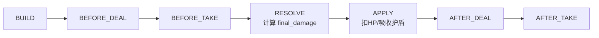
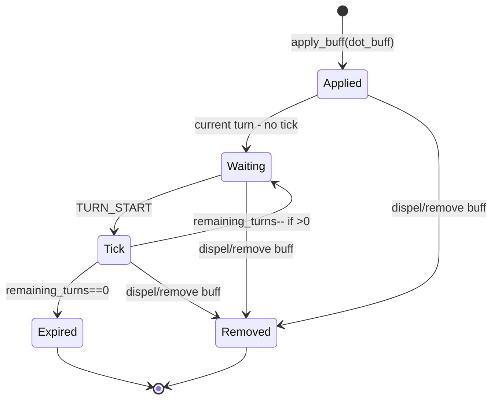

# 06 — Damage / DOT / Turn / Replay：如何把“结算”做成可扩展的骨架

本章目标：
- 理解 DamagePipeline 的固定阶段骨架（为什么要分 stage）
- 理解 DOT 为什么由 DotInstance 管理，以及 TURN_START tick 的约定
- 理解 Replay 的定位：只记录输出，不参与逻辑
- 理解 roll_key 在确定性中的角色（和技能系统如何配合）

---

## 1. DamagePipeline：固定阶段骨架

代码位置：`res://addons/omnibuff/runtime/core/damage_pipeline.gd`

阶段（当前实现）：
- `BUILD`
- `BEFORE_DEAL`
- `BEFORE_TAKE`
- `RESOLVE`
- `APPLY`
- `AFTER_DEAL`
- `AFTER_TAKE`

为什么要分阶段？
- 让 buffs 能在不同语义节点介入（例如“加基础伤害”应发生在 RESOLVE 之前）
- 让“攻击方被动”和“防守方被动”各自有清晰的触发点
- 让 debug/replay 能按阶段归档“哪些 buff 被触发”

---

## 2. DamageContext：哪些字段是“强约定”

DamageContext（RefCounted）是阶段之间传递的载体。

强约定字段（会被 filters/actions 用到）：
- `attacker_id` / `defender_id`
- `tags_mask`
- `hit` / `crit`
- `base_damage` / `final_damage`
- `skill_id` / `damage_type` / `element`（供 filters）

meta（弱耦合扩展点）：
- `runtime`：用于 actions 跨实体取对象
- `turn_index` / `roll_key`：用于确定性 RNG、追帧
- `is_bonus_damage`：BONUS_DAMAGE guard

---

## 3. 确定性：roll_key 到底怎么影响命中/暴击

Pipeline 里的命中/暴击使用确定性 RNG（xorshift32），seed 来自：
- `turn_index`
- `roll_key`
- `attacker_id`
- `defender_id`
- `salt`

结论：
- 你必须把 roll_key 当作“每个独立结算点的唯一键”
- 多段、多目标、追加伤害若 roll_key 冲突，会导致复盘不一致（并且可能出现 hit/crit 被错误复用）

推荐做法见：
- `res://addons/omnibuff/docs/integrator_guide.md` 第 9 章（技能系统接入建议）

---

## 4. DOT：为什么不是 BuffInst.remaining_turns

DOT 的权威结构是 `DotInstance`：
- turns/stacks 的递减发生在 DOT tick 中（与回合推进强绑定）

而 BuffInst 只是“DOT 的 owner/配置载体”：
- 负责提供 dot 定义与 tags
- 负责在被驱散/移除时联动清理 dot 池

因此：
- `BuffInst.remaining_turns` 对 DOT 不权威（HUD 会显示 `N/A(DOT)`）
- 想看 DOT 的 turns/stacks，去看 DotInstance（HUD 的 Dots 面板）

---

## 5. TurnComponent：为什么约定 TURN_START tick DOT

代码位置：`res://addons/omnibuff/runtime/components/turn_component.gd`

约定：
- DOT 在 “目标回合开始（TURN_START）” 结算  

这意味着：
- Turn2 给对方挂 DOT，要等 Turn3 start 才第一次掉血  
（很多游戏也是这种语义：避免“当回合刚挂上就立刻跳”导致读条/表现混乱）

---

## 6. Replay：output-only（只记录输出）

Replay 的定位：
1) 调试：把“发生了什么”以可读文本输出（debug_dump）
2) 回归：tests 可以断言 trace 字段
3) 一致性：同输入同输出（尤其依赖 roll_key）

但 Replay **不参与逻辑驱动**：
- 没有 replay 也必须能正常结算
- replay 只作为可选参数传入（鸭子类型 `has_method("trace_damage")`）

这条约束非常重要：
- 否则“关掉 replay 逻辑就变了”，你未来做性能优化或上线开关会踩大坑

---

## 本章小结

你现在应该理解：
- DamagePipeline 的 stage 骨架为什么是扩展点
- DOT 为什么由 DotInstance 管理，TURN_START tick 的意义
- roll_key 为什么决定确定性
- Replay 为什么必须 output-only

下一章我们进入“怎么调试、怎么扩展、怎么回归”。  
继续阅读：`07_debug_and_extend.md`
