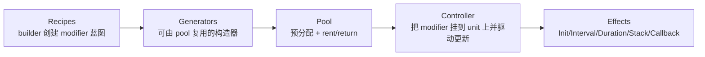

# ModiBuff Tutorial（总览）

> 面向：未做过 Buff 系统的 Godot 开发者（C#）  
> 目标：理解 ModiBuff 的设计原理/设计思想/使用方式，并能读懂其代码与扩展点。  
> 对比：最后一章提供与本仓库 OmniBuff（GDScript 版）的概念级对比。

## 这套 tutorial 覆盖什么

- ModiBuff 的定位：**零依赖、引擎无关、极致性能与零 GC** 的 Buff/Debuff/Modifier 库
- 两层结构：`ModiBuff`（核心后端）与 `ModiBuff.Units`（一个更“游戏化”的实现示例）
- 核心 API：Recipes（Builder/Fluent）、Effects、Intervals/Durations/Stacks、Callbacks、Pooling
- 如何在 Godot C# 项目里集成（推荐流程与常见坑）
- 与 OmniBuff（你的插件）的思想与架构差异（数据驱动 vs 代码驱动、事件模型、调试方式等）

## 推荐阅读顺序

1) `01_overview_and_principles.md`：先理解 ModiBuff 的设计目标与结构  
2) `02_install_and_bootstrap.md`：完成初始化（logger/recipes/pool）  
3) `03_recipes_and_effects.md`：学会写 modifier（init/interval/duration/stack）  
4) `04_units_integration.md`：把它“绑”进你的 Unit/战斗对象  
5) `05_performance_pooling_and_debug.md`：理解 zero-GC 的关键与调参  
6) `06_serialization_and_state.md`：存档/网络同步/可变 state 如何处理  
7) `07_compare_with_omnibuff.md`：与 OmniBuff 的概念级对比与选型建议

## 你应该优先跑的“官方示例”

ModiBuff 仓库里有大量 recipe 示例（建议边看边抄）：
- `README.md`（Usage/Recipe/Installation 等章节）
- `ModifierExamples.md`（按主题分类的 recipe 示例）

---

## 一句话建立心智模型

如果你能把这条链路讲清楚，你就基本能读懂 ModiBuff 的大部分代码。

