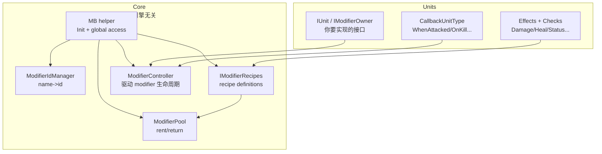

# 01 — ModiBuff 的设计目标与结构（Overview & Principles）

## 1) ModiBuff 是什么

ModiBuff 的 README 对它的定位非常明确：
- **zero dependency、engine-agnostic**（零依赖、引擎无关）
- 目标排序：**Feature Set → Performance → Ease of use**（功能优先，其次性能，再其次易用）  
- 强调 **No GC/runtime heap allocations（fully pooled）**（运行时无堆分配，靠池化复用）  

并且它把自己拆成两层：
- `ModiBuff`：核心后端（modifier 逻辑，尽量不绑定具体游戏逻辑）
- `ModiBuff.Units`：一个“可直接用于游戏”的实现示例，展示如何把核心绑到 Unit 上  

> 这些都是你做阅读与集成时的关键边界：你可以只用 core，也可以直接用 Units。  

---

## 2) 为什么它是“代码驱动”的 Buff 系统

ModiBuff 的高阶入口是 **Recipe builder（Fluent interface）**：

```csharp
Add("InitDamage")
    .Effect(new DamageEffect(5), EffectOn.Init);
```

也就是说：
- 你不是写 JSON/YAML 配置
- 你是用 C# 代码“构建 modifier 蓝图”

收益：
- 强类型（IDE 补全、重构安全）
- 可以写非常复杂的组合（Callbacks、Meta/Post effects、Condition、Stack timer 等）

代价：
- 内容生产更偏“程序化”（策划直接改动不如数据驱动方便）

---

## 3) 一张图看系统边界：Core vs Units



对应到源码（仓库路径）：
- `MB`：`ModiBuff/ModiBuff/Core/ModiBuff.cs`（提供 `MB.Init(...)` 与全局访问点）
- `Config`：`ModiBuff/ModiBuff/Core/Config.cs`（pool size 等关键参数）
- Units recipes 示例：`ModiBuff/ModiBuff.Units/TestModifierRecipes.cs`

---

## 4) “零 GC + 池化复用”意味着什么

如果你以前写过很多 C# gameplay 代码，你可能习惯：
- 每次加 buff new 一个对象
- 每帧 tick 里产生一些临时列表/闭包

ModiBuff 的目标恰好反过来：
- 尽量把 **对象创建** 变成初始化阶段的成本
- 运行时通过 pool 复用（rent/return + state reset）

你会看到它的配置里有大量“容量/池大小”参数（例如 pool size、max pool size），用于支撑这条原则。  

---

## 5) 读代码的建议路线

如果你想快速读懂 ModiBuff 的“主干”：

1) README：先读 Usage/Recipe，建立“动作模型”（Init/Interval/Duration/Stack/Callback）  
2) `MB` 与初始化：看 `ModiBuff.cs`（全局入口）与 `Config.cs`（默认配置）  
3) Recipe：看 Units 的 `TestModifierRecipes.cs`，你会看到 builder 最常用的组合方式  
4) Pool/Controller：再深入 `Core/Pool` 与 `Core/Modifier/ModifierController.cs`（性能与生命周期）

---

## 本章小结

你现在应该能回答：
- ModiBuff 为什么是“引擎无关 + 代码驱动 + 池化复用”
- Core 与 Units 的职责分离是什么

下一章：我们进入“如何在项目里初始化”（logger/recipes/pool）。  
继续阅读：`02_install_and_bootstrap.md`

