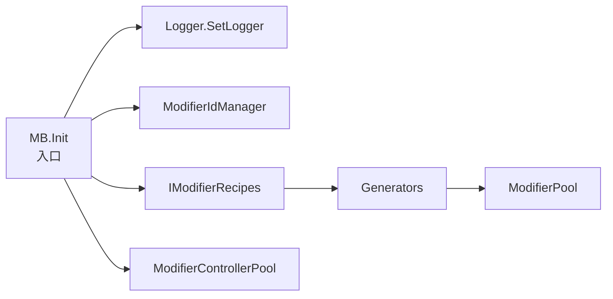

# 02 — 安装与初始化（Installation & Bootstrap）

> 目标：让你在 Godot C# 项目里把 ModiBuff “跑起来”。  
> 注意：ModiBuff 本体是引擎无关库，但仓库提供了 Godot 扩展项目（以及 Asset Library 分发）。

---

## 1) 安装方式概览

根据 ModiBuff README，常见来源包括：
- NuGet（`ModiBuff` 包）
- Godot Asset Library
- 直接拉源码（开发期推荐 source/non-DLL/debug 版本，便于日志与调试）

你作为 Godot 开发者，建议优先选择：
- **开发期**：拉源码或使用 Debug 版本（日志更友好）
- **发布期**：固定版本（NuGet 或 release DLL），避免 master breaking changes

---

## 2) 初始化链路：Logger → IdManager → Recipes → Pool

ModiBuff core 提供一个“全局入口”帮助类 `MB`：

```csharp
MB.Init(logger, idManager => new MyRecipes(idManager));
```

在代码层面，它会创建并持有：
- `ModifierIdManager`
- `IModifierRecipes`
- `ModifierPool`
- `ModifierControllerPool`

你可以把它理解为“一次性把系统装配好”。  



---

## 3) 一个可复制的 Godot C# 初始化示例

> 下面示例假设你使用 Godot 的 Autoload（或单例节点）管理游戏系统。

```csharp
using Godot;
using ModiBuff.Core;
using ModiBuff.Core.Units;

public partial class ModiBuffBootstrap : Node
{
    public override void _Ready()
    {
        // 1) 选择 logger（你可以写自己的 ILogger 实现）
        var logger = new MyGodotLogger();

        // 2) 初始化 MB：注入 recipes 构造函数
        MB.Init(logger, idManager =>
        {
            // 你需要提供自己的 recipes（继承或封装 ModiBuff.ModifierRecipes）
            // README 中给了两种方式：inherit 或 encapsulate
            return new MyModifierRecipes(idManager);
        });

        GD.Print("ModiBuff init done. pool=", MB.Pool);
    }
}
```

注意点：
- `MB` 是全局入口，适合做 demo/项目内工具
- 如果你更偏向依赖注入，也可以不使用 MB，而是在你自己的系统里持有 IdManager/Pool/Controller

---

## 4) Config：你大概率要调整的参数

ModiBuff 的 `Config` 里有多个 pool 相关参数，例如：
- `PoolSize` / `MaxPoolSize`
- `ModifierControllerPoolSize` / `MaxModifierControllerPoolSize`
- `UseDictionaryIndexes`（数组 vs 字典的取舍）

你可以在 `MB.Init` 前设置：

```csharp
//Config.MaxPoolSize = 10000;
//Config.UseDictionaryIndexes = true;
```

建议策略：
- **先用默认值跑通**（不要一上来就调参）
- 遇到明显的 pool miss 或内存压力，再按 benchmark/项目规模定向调

---

## 5) 初始化完成后你能做什么

完成初始化后，你至少应该能：
- 通过 recipes name 获得 modifier id（或直接用 name 添加）
- 创建 unit（要实现相应接口）并挂载 modifier controller
- 添加一个最简单的 recipe（InitDamage），观察 effect 被触发

下一章会具体讲 “recipes 怎么写、怎么触发”。  
继续阅读：`03_recipes_and_effects.md`

