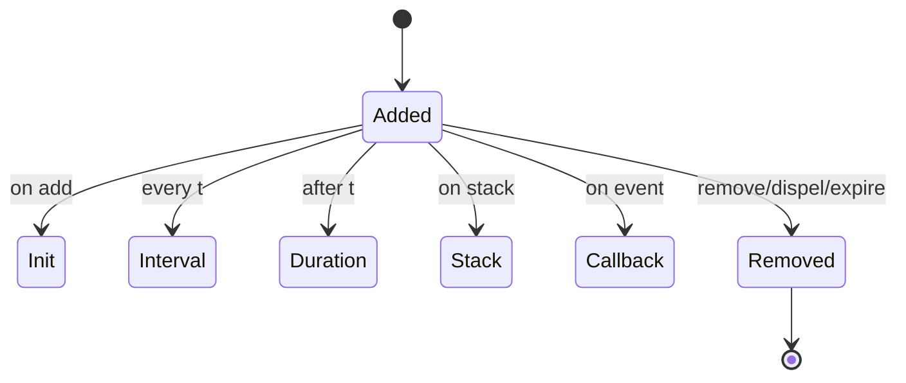
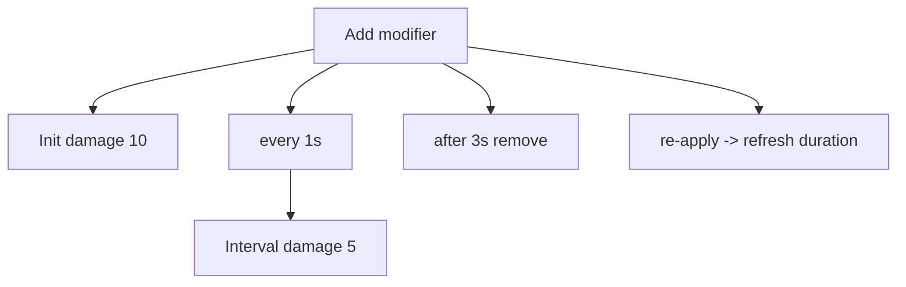

# 03 — Recipes 与 Effects：用 Builder 写出“可组合的 Buff”

本章是 ModiBuff 的核心使用方式：**Recipe builder（Fluent interface）**。

你会学到：
- modifier 的“动作模型”（Init/Interval/Duration/Stack/Callback）
- 常见 recipe 写法（伤害、DOT、状态、触发器）
- 如何从“看起来很复杂的链式调用”拆成可理解的模块

---

## 1) 先建立动作模型：EffectOn

ModiBuff 把一个 modifier 的生命周期拆成多个“动作点”：

- `Init`：添加时触发
- `Interval`：每隔 X 秒触发
- `Duration`：持续时间触发（常用来做 remove）
- `Stack`：叠层触发
- `Callback`：来自 Unit 或 Effect 的回调触发

你可以把它理解为：



---

## 2) 最小例子：Init Damage

来自 README 的最小示例：

```csharp
Add("InitDamage")
    .Effect(new DamageEffect(5), EffectOn.Init);
```

你可以把它翻译成一句话：
> 当 modifier 被添加到目标单位时，触发一次 DamageEffect(5)。

---

## 3) DOT：Init + Interval + Remove + Refresh

README 给了一个经典 DOT 例子：
- 添加时打 10
- 每秒打 5
- 3 秒后移除
- 如果重复施加则刷新持续时间

```csharp
Add("Init_DoT_Remove_Refreshable")
    .Interval(1)
    .Effect(new DamageEffect(10), EffectOn.Init)
    .Effect(new DamageEffect(5), EffectOn.Interval)
    .Remove(3)
    .Refresh();
```

拆解：



---

## 4) 叠层：OnMaxStacks / EveryXStacks / Independent timers

ModiBuff 的叠层能力非常强，`ModifierExamples.md` 里有大量例子：

- 达到最大层数触发一次伤害：

```csharp
Add("DamageOnMaxStacks")
    .Effect(new DamageEffect(5, StackEffectType.Effect), EffectOn.Stack)
    .Stack(WhenStackEffect.OnMaxStacks, value: -1, maxStacks: 2);
```

- 每两层触发一次：

```csharp
Add("DamageEveryTwoStacks")
    .Effect(new DamageEffect(5, StackEffectType.Effect), EffectOn.Stack)
    .Stack(WhenStackEffect.OnXStacks, value: -1, maxStacks: -1, true, everyXStacks: 2);
```

你可以把 stack 看成“自带规则的计数器”，触发点与复位策略由 `Stack(...)` 统一管理。

---

## 5) Callback：把“被动触发”写成 recipe

例如荆棘：被攻击时反伤（ModifierExamples 中也有类似例子）：

```csharp
Add("ThornsOnHitEvent")
    .Effect(new DamageEffect(5, targeting: Targeting.SourceTarget), EffectOn.CallbackUnit)
    .CallbackUnit(CallbackUnitType.WhenAttacked);
```

要点：
- “事件源”来自 Unit（WhenAttacked/OnKill 等）
- 触发时 `Targeting.SourceTarget` 决定伤害从谁指向谁

这是一种典型的“系统边界”：
- ModiBuff core 提供 callback 槽位与执行模型
- 你在 Unit 层把游戏事件映射成 callback（详见下一章）

---

## 6) 复杂链式 recipe：如何读懂

README 里展示过非常复杂的组合式 modifier（多 callback、多 effect、多 stack 行为）。  
阅读技巧：

1) 先找结构性语句：`.Interval()` `.Remove()` `.Stack()` `.CallbackUnit()`  
2) 再把每个 `.Effect(...)` 按 `EffectOn.*` 分类  
3) 再看 Tag/ModifierAction/Meta/Post 等“高级控制项”  

建议你用“分类表”做笔记：

| 类别 | 你要找什么 |
|---|---|
| 时间轴 | Interval/Duration/Remove/Refresh |
| 触发点 | Init/Interval/Stack/Callback |
| 目标 | Targeting（source/target/self） |
| 约束 | ApplyChance/Cost/Cooldown/Condition |
| 高级行为 | ModifierAction / Applier / Meta/Post |

---

## 本章小结

你现在应该能：
- 写出基础 modifier：Init、DOT、Stack、Callback
- 把复杂链式写法拆成“时间轴 + 触发点 + effect 列表”

下一章：如何把 ModiBuff “绑”进你的 Unit（事件源与状态容器）。  
继续阅读：`04_units_integration.md`

