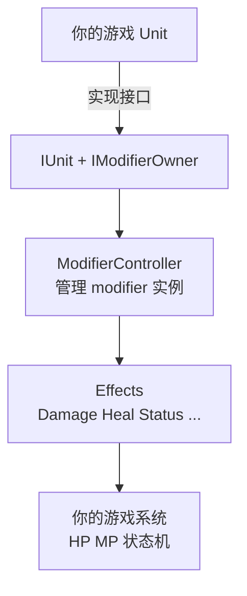
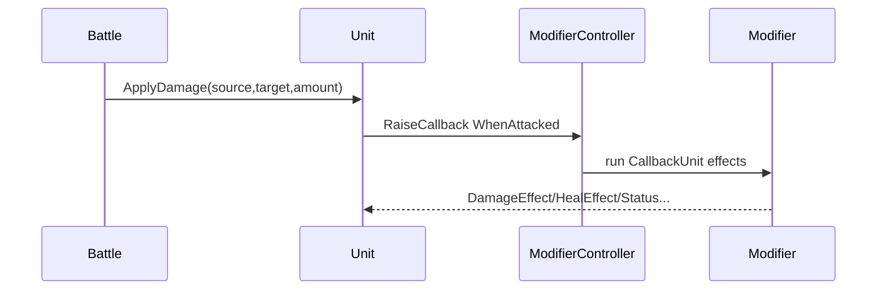

# 04 — 与你的 Unit/战斗对象集成（ModiBuff.Units）

本章解释：为什么 ModiBuff 要提供 `ModiBuff.Units`，以及你作为 Godot 开发者该如何对接。

核心思想：
- Core 是“引擎无关的 modifier 引擎”
- Units 是“示范一套游戏侧接口与常见 effect 实现”（Damage/Heal/Status/Checks/Callbacks）

---

## 1) 两种集成路线：用 Units 或自建 Units

README 给了两条路：

1) **直接使用 ModiBuff.Units**
- 你沿用作者提供的 Unit/接口/Effects/Checks
- 上手快，示例齐全

2) **Custom Units（推荐给成熟项目）**
- 你实现 `IUnit`、`IModifierOwner` 等接口
- 你定义自己的游戏接口（比如 `IDamageable`、`IHealable`）
- 你写自己的 Effects（或复用 Units 的部分 effect）

---

## 2) Unit 回调：CallbackUnitType 与战斗事件

你会在 `ModifierExamples.md` 看到很多“事件驱动”例子，例如：
- WhenAttacked
- OnKill
- WhenKilled
- StrongHit

这些例子的关键不是 DamageEffect，而是：
- **谁产生事件**
- **事件发生时如何把 source/target 传进去**

典型模式：

你需要在你的战斗系统里做的是：
- 把“攻击/施法/死亡/受击”等事件，映射成 Unit callback
- 让 ModifierController 在正确时机被 tick（如果你的 modifier 有 interval/duration）

---

## 3) Targeting：effect 的目标选择

在 ModiBuff 的 recipe 里经常看到 `Targeting.SourceTarget` 之类的参数。  
直觉解释：
- Source：触发者/施加者（例如攻击者）
- Target：被作用者（例如受击者）

建议在你自建 Units 时也维持这套语义一致性，否则你会在读别人的 recipe 时反复迷糊。

---

## 4) 推荐的“最小可用” Unit 设计

对于一个刚开始做战斗系统的 Godot 项目，我推荐先把 Unit 拆成三块：

1) **状态容器**：HP/MP/状态标记、抗性、基础属性  
2) **事件入口**：TakeDamage/Heal/AddStatus/RemoveStatus  
3) **Modifier 接入层**：ModifierController + Tick

这样做的收益：
- 你能明确“ModiBuff 改的是 3)”  
- 业务逻辑（技能/AI/移动）改的是 1) 与 2)

---

## 5) 从 ModiBuff 的示例 recipes 学到什么

`TestModifierRecipes.cs` 里同时展示了：
- 典型 builder 写法（Interval + Effect + Remove + Refresh）
- 手写 modifier（Manual）以获得完全控制

你可以把它当作：
> “作者认为最常用的用法模板”

阅读建议：
- 先看 builder 的部分（最常用）
- 再看 manual 的部分（当你需要极致性能/定制生命周期时参考）

---

## 本章小结

你现在应该知道：
- ModiBuff.Units 的价值：提供“游戏侧接口 + effect 生态”
- 你在自己的战斗系统里要做什么：事件映射、tick 时机、Targeting 语义对齐

下一章：零 GC 的关键：pool/容量/调参/日志与 debug。  
继续阅读：`05_performance_pooling_and_debug.md`

