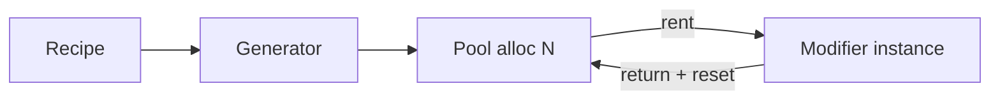

# 05 — 性能、池化与调试（Zero GC 的关键）

ModiBuff 的 README 把性能作为核心卖点之一：
- 运行时无 GC/堆分配（fully pooled with state reset）
- benchmark 里展示了大量“10_000 modifiers/units”级别的指标

本章用“可操作”的视角解释：你在集成时应该关注什么。

---

## 1) 为什么“对象池”对 Buff 系统特别重要

Buff 系统的典型压力源：
- 频繁新增/移除 modifier（hit、proc、DOT、临时状态）
- 每帧 tick interval/duration
- 多单位并发（怪群、召唤物、投射物）

如果每次都 new 一个对象：
- 会导致分配抖动与 GC 卡顿

ModiBuff 的策略：
- 用 `ModifierPool` 预分配（按 recipe/类型分池）
- 使用时 rent，结束 return
- return 时做 state reset（避免脏状态泄漏到下一次复用）

---

## 2) 你需要知道的几个 Config 参数

在 `Config.cs` 里（示例）：
- `PoolSize` / `MaxPoolSize`
- `ModifierControllerPoolSize` / `MaxModifierControllerPoolSize`
- `DefaultModifierArraySize`
- `UseDictionaryIndexes`（数组 vs 字典索引）

`UseDictionaryIndexes` 的注释强调：
- 数组更快（大约 30%）
- 但会用 O(n) 的 int32 内存（n=modifier 数量）
- 在“modifier 很多 + 单位很多 + 想省内存”的场景可能需要字典索引

建议策略：
1) 先用默认配置跑通逻辑  
2) 在你的“最坏场景”录一次 profile（例如 2000 单位 + 大量 DOT）  
3) 再按瓶颈选择是否开启字典索引/调大池容量  

---

## 3) 如何为不同 modifier 预留不同的池容量

ModiBuff 的 Config 里有一个 `ModifierAllocationsCount`（按名字分配数量）：
- 你可以为“高频 modifier”（例如 DoT tick、投射物 hit）分配更大的池
- 为“低频 modifier”（例如 30 秒大招 buff）分配较小池

> 这条策略特别适合 MOBA/ARPG：高频 proc 数量往往远超你直觉。

---

## 4) 调试：先保证“可观测”

ModiBuff 强烈建议开发期使用 source/non-DLL/debug 版本（README 中提到这能提供更好的 logging/debug）。

你作为 Godot 开发者，建议把“可观测”做成固定工作流：
- 你的 Unit 上提供一个 debug dump（当前 modifiers 列表）
- 你的 battle loop 能输出 “某个事件触发了哪些 callback”
- 你的 recipe 命名保持可读（否则日志会变成乱码）

这与 OmniBuff 的策略不同：
- OmniBuff 走 UI demo + Debug HUD + ErrorList + Replay 输出
- ModiBuff 更偏“代码内日志 + dump + benchmark 驱动调参”

---

## 本章小结

你现在应该理解：
- Buff 系统为何容易产生 GC 抖动
- ModiBuff 如何用 pool 规避（以及你该如何调 Config）
- 调试上更推荐“开发期源码 + 日志/dump”

下一章：序列化与可变 state（存档/回放/网络同步的基础）。  
继续阅读：`06_serialization_and_state.md`

