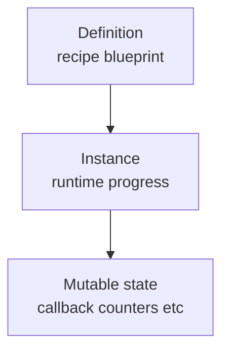

# 06 — 序列化与可变 State（Serialization & Mutable State）

ModiBuff 的 README 把序列化能力也列为核心特性之一：
- “Open generic serialization（of all mutable state and id's）”
- 支持 `System.Text.Json`

本章用“你在游戏里会遇到的问题”来组织：
- 存档：关闭游戏再打开，Buff 还在
- 回放：复盘一次战斗（或至少复盘关键数值）
- 网络：在不同机器上同步 Buff 状态（更难）

---

## 1) 先分清三类状态

对一个 modifier 来说，你通常有三类状态：

1) **配置（Definition）**  
例如：伤害=5、间隔=1 秒、持续=3 秒、最大层数=4  
这类通常来自 recipe 本身（蓝图）

2) **运行时进度（Runtime Progress）**  
例如：剩余持续时间、距离下一次 interval 的时间、当前 stacks  
这类必须被保存，否则读档会“时间轴错乱”

3) **可变业务 state（Mutable State）**  
例如：某个 callback 里累计的计数器、某个效果内部的累加值  
这类是最容易被忽略、也最容易导致“读档后逻辑变了”的部分

---

## 2) 为什么“可变 state”很关键

ModiBuff 的 examples 里有不少 callback 会维护计数器，比如：
- “累计受到的伤害达到阈值才移除”
- “被眩晕 4 次触发一次驱散”

如果你只保存 stacks/duration，但不保存这些计数器：
- 读档后逻辑会偏移（甚至出现 exploit）

因此你在写自定义 effects/callbacks 时要养成习惯：
- 明确哪些字段是“可变 state”
- 明确它们如何被序列化（以及如何 reset）

---

## 3) 实务建议：先做“存档一致性”，再谈网络一致性

对多数 Godot 项目而言，推荐分阶段：

1) **先保证读档一致**
- 保存：当前 modifiers 列表、每个 modifier 的 runtime progress、以及必要的 mutable state
- 加载：按顺序恢复，保证 tick 后行为一致

2) 再考虑“回放一致”
- 回放往往需要确定性 RNG（roll_key/seed 的概念）
- ModiBuff 本身不强制提供 roll_key 约束；你需要在上层战斗系统设计自己的确定性策略

3) 最后才是网络
- 网络同步不仅要 state，还要事件顺序与 tick 对齐
- 建议在你战斗系统稳定后再做

---

## 4) 与 OmniBuff 的序列化思路差异

概念级差异（不涉及谁更好，只看取舍）：

- **ModiBuff**：偏“对象图 + 可变 state 的通用序列化”（更灵活，但你需要更严格的工程纪律）  
- **OmniBuff**：偏“数据驱动 + 运行时结构可 dump + Replay output-only”（更容易做 QA/复现与回归）  

这也是两者“设计目标优先级”不同带来的自然结果：
- ModiBuff 优先性能与能力上限
- OmniBuff 优先工程化可维护与易集成（尤其在 GDScript 侧）

---

## 本章小结

你现在应该能：
- 区分 Definition / Runtime Progress / Mutable State
- 理解为什么 callback 里的计数器也要能保存

下一章：与 OmniBuff 的概念级对比（帮助你选型/借鉴）。  
继续阅读：`07_compare_with_omnibuff.md`

