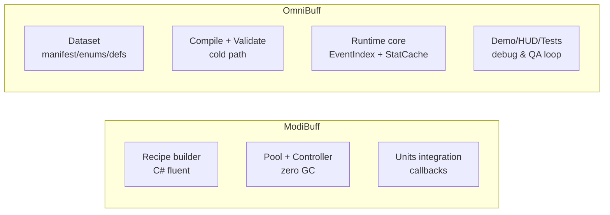
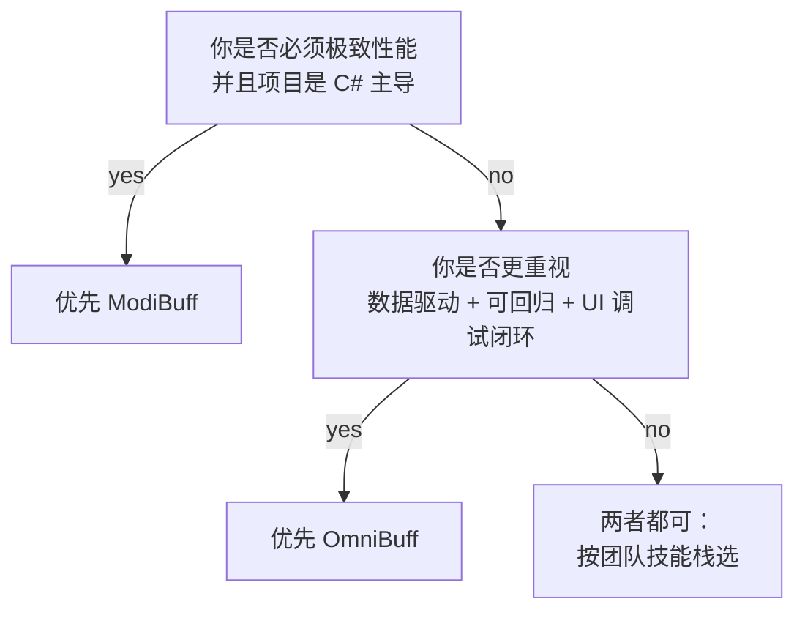

# 07 — ModiBuff vs OmniBuff：概念级对比（选型与互相借鉴）

> 目标：帮助读者理解两套系统的“设计取舍”，并知道在什么场景用哪套、或如何互相借鉴。

---

## 1) 一句话总结

- **ModiBuff**：C# 代码驱动的 modifier 引擎，目标是 **极致性能 + 强表达能力 + 零 GC**，并提供 Units 作为游戏化示例实现。  
- **OmniBuff（本仓库）**：GDScript 数据驱动的 Buff 系统，目标是 **可维护/可回归/易接入**，并提供 demo/HUD/tests 形成工程化闭环。  

---

## 2) 架构边界对比

理解边界的关键：
- ModiBuff 把“规则”主要放在 C# 代码里（recipes/effects/callbacks）
- OmniBuff 把“规则”主要放在数据集里（buff_defs/stat_defs/enums），运行时只读 compiled dataset

---

## 3) “规则表达”方式：代码驱动 vs 数据驱动

### ModiBuff（代码驱动）

优点：
- 强类型 + IDE 体验好
- 适合写非常复杂的组合（callbacks/conditions/meta/post/stack timers）

缺点：
- 内容生产更依赖程序（策划直接改动门槛更高）
- 版本差异更容易通过代码路径体现（需要 discipline）

### OmniBuff（数据驱动）

优点：
- schema 治理：enums/validators 让 DSL 更可靠
- 可视化与 QA 更方便（scenario + HUD + ErrorList + tests）

缺点：
- DSL 的表达上限受限（太复杂就会变成“写 JSON 写到像写代码”）

---

## 4) 性能策略对比

### ModiBuff

- 以 **pool + state reset** 实现 “运行时无堆分配”
- 通过 Config 调整池容量、数组/字典索引策略

适合：
- 极端单位数量与高频 proc 场景（并且你愿意投入时间调参/做 profile）

### OmniBuff

- 通过 **EventIndex（listeners subset）** 避免全量遍历
- 通过 **StatCache（dirty + recompute）** 避免重复计算
- 不强调“零分配”，更强调“工程上可维护的性能约束”

适合：
- Godot/GDScript 环境下的“可控性能 + 强可回归”

---

## 5) 事件模型对比：Callback vs EventIndex + Scope

### ModiBuff

典型是 Unit 发出 callback（WhenAttacked/OnKill/StrongHit...），modifier 订阅并触发 effect。

优点：
- 对接游戏逻辑自然（你本来就有这些事件）

注意点：
- 你需要自己保证 “事件顺序稳定” 与 “tick 时机一致”

### OmniBuff

显式事件域：
- `DAMAGE`（pipeline stages）
- `DOT`（turn tick）
- `LIFE`（DEATH/REVIVE）
- `COMMAND`（指令型）

并引入 `scope + runtime dict` 作为跨实体定位契约：
- `SELF/SOURCE/TARGET`
- `runtime = {stats_by_entity, buff_by_entity}`

优点：
- 事件分发可被索引（监听子集遍历）
- 行为更容易做“可复现的 scenario”

---

## 6) 调试体验对比（非常关键）

### ModiBuff

更偏向：
- 源码版本 + logger 输出
- dump 当前 modifier 列表
- benchmark/profiler 驱动调参

### OmniBuff

更偏向：
- UI demo（scenario runner）
- Debug HUD（Stats/StatMods/Buffs/Dots/Listeners）
- ErrorList（错误汇总与跳转）
- GUT tests（回归）

结论：
- 如果团队规模大、交接频繁、需要策划与 QA 深度参与，OmniBuff 的“工程化调试闭环”更具优势

---

## 7) 互相借鉴建议

### 从 ModiBuff 借鉴到 OmniBuff

- 更系统化的 stack timer/independent stack timers 思路（可做 Phase 3/4）
- 更强的“可组合 effect”模型（尤其 meta/post effect 的表达）

### 从 OmniBuff 借鉴到 ModiBuff

- Dataset + validators 的 schema 治理思路（让 rules 更易审计）
- scenario runner + HUD 的工程化调试方式（降低学习门槛）

---

## 8) 选型建议（简单决策树）

